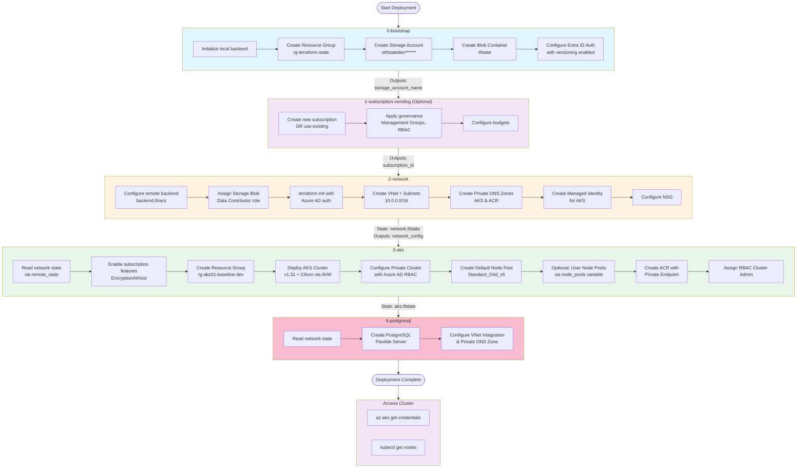
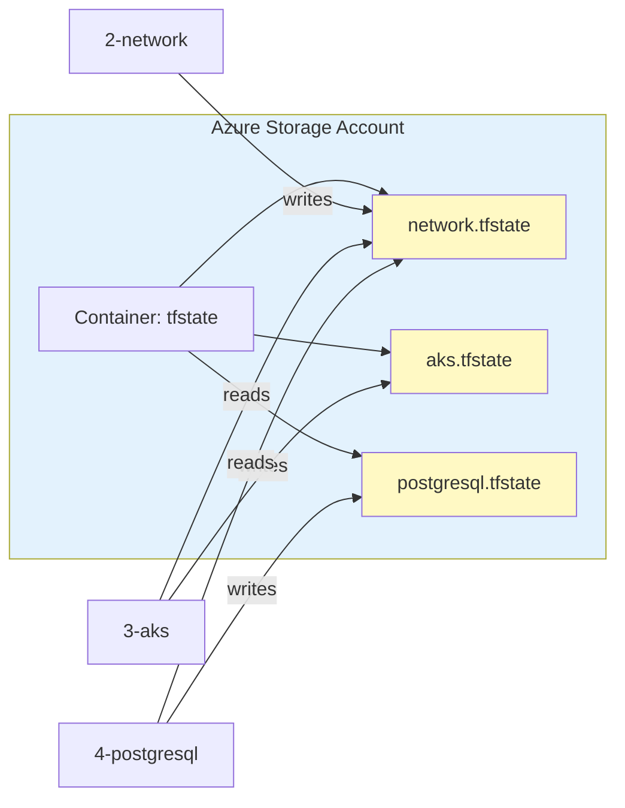
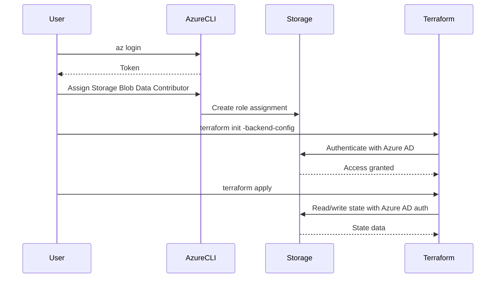
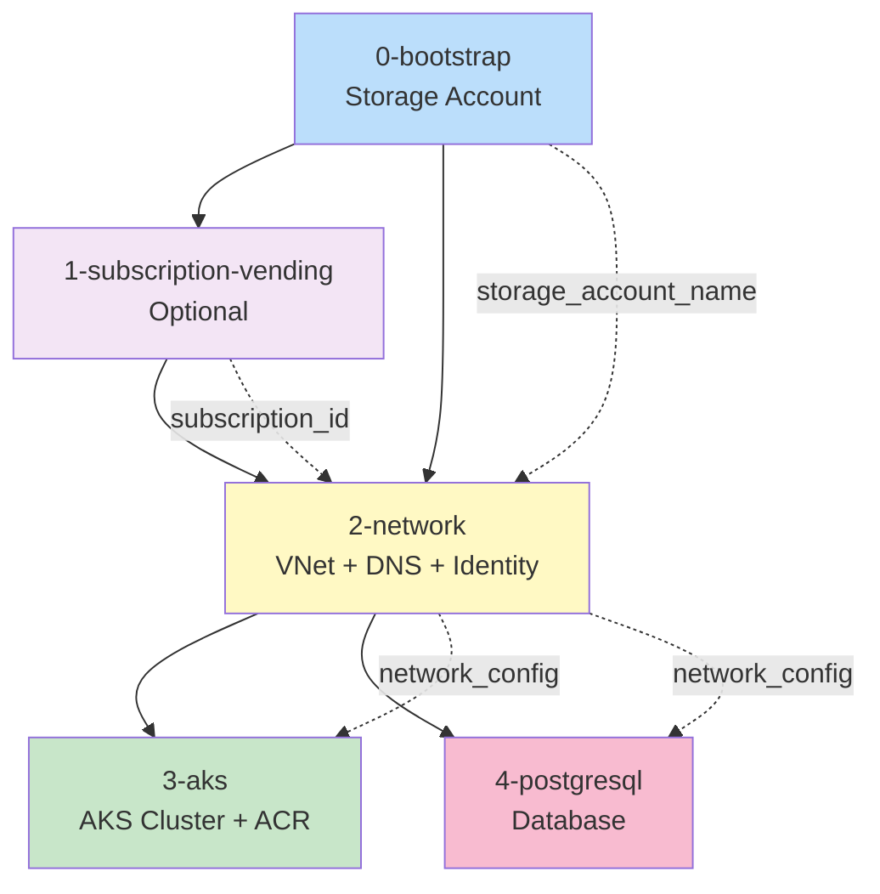
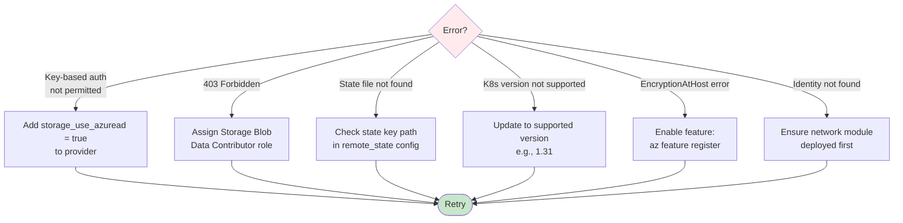

# AKS Deployment Flow

## Overview
This repository deploys a production-ready Azure Kubernetes Service (AKS) cluster using a modular, sequential approach with Terraform remote state management.

> **📖 For step-by-step deployment instructions, see each module's README.**  
> This document provides a visual overview of the deployment flow and architecture.

---

## Deployment Flowchart



---

## Deployment Phases

### Phase 1: Bootstrap (0-bootstrap)
**Purpose**: Create remote state storage for all modules

**Creates**:
- Resource Group: `rg-terraform-state`
- Storage Account: `sttfstatedevXXXXXX` (random suffix)
  - GRS replication
  - Blob versioning enabled
  - 30-day delete retention
- Container: `tfstate`
- Azure AD (Entra ID) authentication configured

**Outputs**: `storage_account_name` → Used by all subsequent modules

📖 **[Full instructions → 0-bootstrap/README.md](0-bootstrap/README.md)**

---

### Phase 2: Subscription Vending (1-subscription-vending) - OPTIONAL
**Purpose**: Create or configure Azure subscriptions with governance

> **Skip this phase** if you already have a subscription to use.

**Creates** (if creating new subscription):
- New Azure Subscription
- Management Group association
- Role assignments
- Budgets

**Outputs**: `subscription_id` → Can be used by subsequent modules

📖 **[Full instructions → 1-subscription-vending/README.md](1-subscription-vending/README.md)**

---

### Phase 3: Network Foundation (2-network)
**Purpose**: Create network infrastructure and prerequisites

**Creates**:
- Resource Group: `rg-aks-network-dev`
- Virtual Network: `vnet-aks-dev` (10.0.0.0/16)
- Subnets:
  - `snet-aks-system` (10.0.0.0/22)
  - `snet-private-endpoints` (10.0.4.0/24)
- Private DNS Zones:
  - `privatelink.australiaeast.azmk8s.io`
  - `privatelink.azurecr.io`
- Managed Identity: `id-aks-dev`
- Network Security Group (optional)

**State File**: `tfstate/network.tfstate`

**Outputs** → `network_config`: VNet ID, Subnet IDs, DNS Zone IDs, Managed Identity

📖 **[Full instructions → 2-network/README.md](2-network/README.md)**

---

### Phase 4: AKS Deployment (3-aks)
**Purpose**: Deploy production AKS cluster using Azure Verified Modules

**Reads Remote State**: `network.tfstate` → Gets VNet, subnets, DNS zones, identity

**Creates**:
- Resource Group: `rg-aks01-baseline-dev`
- AKS Cluster: `aks01-baseline-dev`
  - Kubernetes: v1.31
  - Network Policy: Cilium
  - CNI: Azure Overlay (pods: 10.244.0.0/16)
  - Service CIDR: 10.245.0.0/16
  - Private Cluster: enabled
- Node Pools:
  - Default: Standard_D4d_v5 (autoscaling via AVM module)
  - User: Optional, configured via `node_pools` variable
- Azure Container Registry: `acr01baselinedev` (with private endpoint)
- Role Assignments:
  - Azure Kubernetes Service RBAC Cluster Admin

**State File**: `tfstate/aks.tfstate`

**Outputs**: `cluster_id`, `cluster_name`, `cluster_fqdn`, `kube_config_raw`, `oidc_issuer_url`

📖 **[Full instructions → 3-aks/README.md](3-aks/README.md)**

---

### Phase 5: PostgreSQL Deployment (4-postgresql)
**Purpose**: Deploy PostgreSQL Flexible Server with VNet integration

**Reads Remote State**: `network.tfstate` → Gets VNet ID for Private DNS Zone linking

**Creates**:
- Resource Group (configurable via variable)
- PostgreSQL Flexible Server (AVM module)
  - Configurable SKU, storage, and version
  - Azure AD and/or password authentication
  - Optional high availability
  - Geo-redundant backup support
- Private DNS Zone: `privatelink.postgres.database.azure.com` (when using VNet integration)
- Private DNS Zone VNet Link

**State File**: `tfstate/postgresql.tfstate`

**Outputs**: `postgresql_id`, `postgresql_name`, `postgresql_fqdn`, `connection_string`

📖 **[Full instructions → 4-postgresql/README.md](4-postgresql/README.md)**

---

## State Management Flow



---

## Authentication Flow



---

## Configuration Files Structure

```
aksavm/
├── 0-bootstrap/
│   ├── main.tf              # Bootstrap resources
│   ├── variables.tf         # subscription_id, environment
│   └── terraform.tfstate    # LOCAL state only
│
├── 1-subscription-vending/  # OPTIONAL
│   ├── main.tf              # Subscription vending module
│   ├── variables.tf         # Subscription configuration
│   └── outputs.tf           # subscription_id output
│
├── 2-network/
│   ├── main.tf              # Network resources + AVM module
│   ├── variables.tf         # Network configuration
│   ├── versions.tf          # Backend: azurerm (remote)
│   └── outputs.tf           # network_config output
│
├── 3-aks/
│   ├── main.tf              # AKS + remote state data source
│   ├── variables.tf         # AKS configuration
│   ├── versions.tf          # Backend: azurerm (remote)
│   ├── locals.tf            # Azure client config
│   └── outputs.tf           # Cluster outputs
│
├── 4-postgresql/
│   ├── main.tf              # PostgreSQL Flexible Server
│   ├── variables.tf         # Database configuration
│   ├── versions.tf          # Backend: azurerm (remote)
│   └── outputs.tf           # Connection outputs
│
└── environments/
    └── dev/
        ├── backend.tfvars       # Backend config for 2-network
        ├── aks-backend.tfvars   # Backend config for 3-aks
        ├── postgresql-backend.tfvars  # Backend config for 4-postgresql
        ├── network.tfvars       # Network variables
        ├── aks.tfvars           # AKS variables
        └── postgresql.tfvars    # PostgreSQL variables
```

---

## Key Dependencies



---

## Variables Flow

### Bootstrap → Network
```
backend_config (from bootstrap output)
  ↓
environments/dev/backend.tfvars
  ↓
terraform init -backend-config
```

### Network → AKS
```
network.tfstate (remote state)
  ↓
data.terraform_remote_state.network
  ↓
outputs.network_config {
  subnet_aks_system_id
  private_dns_zone_aks_id
  identity_id
}
  ↓
module.aks_cluster inputs
```

---

## Troubleshooting Flow



---

## Summary

1. **Bootstrap (0-bootstrap)**: Creates shared remote state storage (run once)
2. **Subscription Vending (1-subscription-vending)**: Optional - creates/configures subscriptions
3. **Network (2-network)**: Creates foundation infrastructure, stores state remotely
4. **AKS (3-aks)**: Reads network state, deploys AKS cluster and optional ACR
5. **PostgreSQL (4-postgresql)**: Reads network state, deploys PostgreSQL Flexible Server with VNet integration
6. **Access**: Use Azure CLI to get kubeconfig and access cluster

All modules use Entra ID authentication for state storage (no access keys needed).
